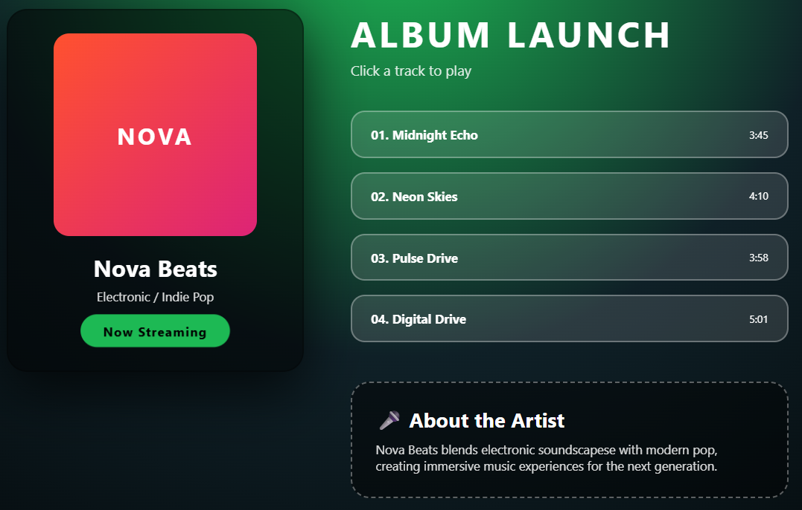

# 🎵 Nova Beats - Music Player Project

This is a simple **Music Player / Album UI** project built using HTML and CSS.  
It displays an album layout with track list and audio playback functionality.

---

## 🚀 Features
- 🎨 Modern music album UI design
- 🎧 Clickable track selection using radio buttons
- ▶️ Audio playback for each song
- 🎤 Artist information section
- 📱 Clean and structured layout

---

## 🛠️ Technologies Used
- HTML5  
- CSS3  

---

## 📸 Preview

---

## 📂 How to Use
1. Download or clone this repository  
2. Open `index.html` in any browser  
3. Click on any track to play music 🎧  

---
## 🌐 Live Demo
https://somasindhuja.github.io/music-player/

---

## 👩‍💻 About the Project
This project is inspired by modern music streaming apps. It helps in practicing UI layout design, audio elements, and CSS styling.

---

## ⭐ Note
This project is created for learning purposes to improve HTML and CSS skills.

---

## 🙌 Author
Soma Sindhuja
